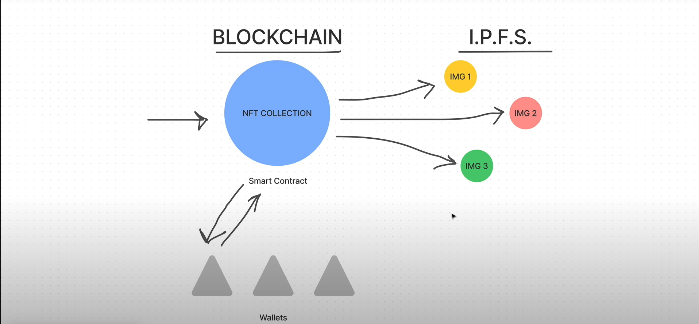
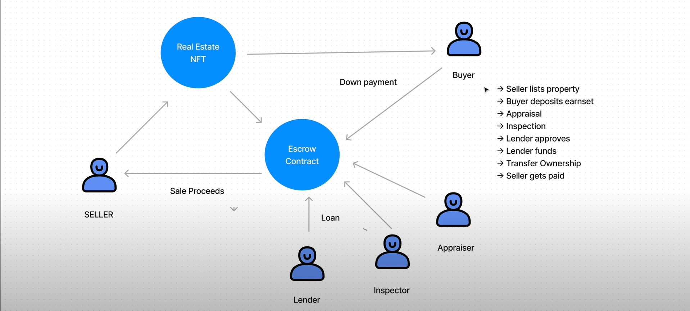
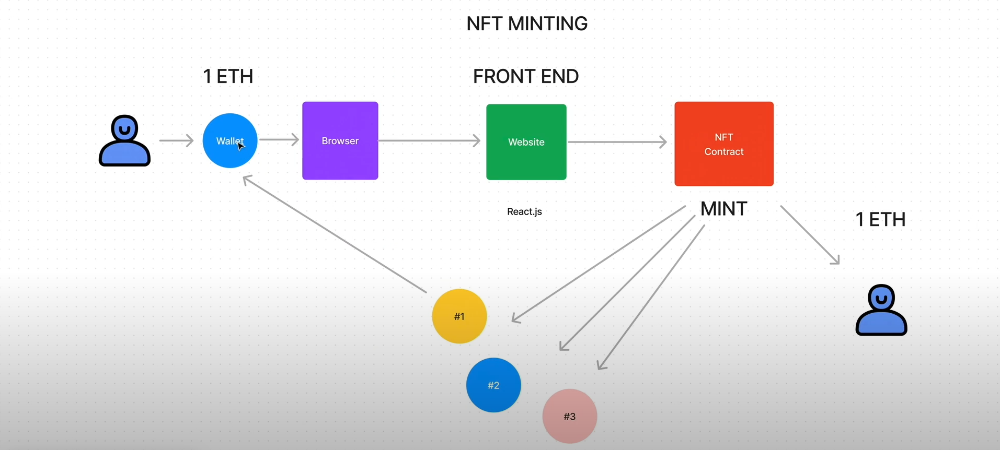

# DeedMint — Web3 Real-Estate Escrow dApp

Tokenize properties as ERC-721 NFTs and complete sales through a programmable **escrow** with roles for **buyer, seller, lender, and inspector**.  
Stack: **Solidity + Hardhat + Ethers.js + React + IPFS**.



---

## ✨ Features

- **Property NFTs (ERC-721)** — tokenized deeds with on-chain `tokenURI`.
- **Escrow smart contract** — lists properties, collects earnest money, records inspection, approvals, and **atomically** transfers NFT and funds.
- **Role flow** — Buyer, Seller, Lender, Inspector (approvals enforced on-chain).
- **IPFS metadata & images** — CIDs referenced by `tokenURI`.
- **React front end** — browse listings, connect wallet, view details.
- **Hardhat test suite** — unit tests for escrow lifecycle.

---

## 🧱 Architecture



- `RealEstate.sol` (ERC721URIStorage): mints property NFTs and stores `tokenURI`.
- `Escrow.sol`: holds listed NFTs, takes earnest deposit, tracks inspection & approvals, finalizes sale (pays seller & transfers deed).

NFT minting pipeline:



---

## 🚀 Quickstart

### 1) Clone & install
```bash
git clone https://github.com/Electrolight123/Deedmint-real-estate-dapp.git
cd deedmint-real-estate-dapp
npm install
```

### 2) Start a local chain
```bash
npx hardhat node
```

### 3) Configure the IPFS base (optional but recommended)
Edit `scripts/deploy.js` and set your CID:
```js
const BASE = 'ipfs://QmczwrtxDYNu1mJwnG69bJg1AN9QdArfQQoiVdQWcs1wmu'; // <- your folder with 1.json, 2.json, 3.json
// ...
const tx = await realEstate.connect(seller).mint(`${BASE}/${i + 1}.json`);
```

> Each `*.json` should include `"image": "ipfs://<CID>/<n>.png"` and attributes like `Purchase Price`, `Bed Rooms`, `Bathrooms`, `Square Feet`, etc.

### 4) Deploy contracts to localhost
In a **new terminal**:
```bash
npx hardhat run scripts/deploy.js --network localhost
```
Copy the printed addresses into `src/config.json` if they differ.

### 5) Run the front end
```bash
npm start
```
In MetaMask, add/switch to:
- **Network name:** Hardhat Localhost  
- **RPC URL:** `http://127.0.0.1:8545`  
- **Chain ID:** `31337`  
- **Currency:** ETH

---

## 📂 Project Structure

```
Deedmint-real-estate-dapp/
├─ contracts/
│  ├─ Escrow.sol
│  └─ RealEstate.sol
├─ scripts/
│  └─ deploy.js
├─ src/
│  ├─ abis/
│  │  ├─ Escrow.json
│  │  └─ RealEstate.json
│  ├─ assets/
│  │  ├─ diagram-nft-ipfs-architecture.png
│  │  ├─ diagram-escrow-real-estate-flow.png
│  │  └─ diagram-nft-minting-frontend-to-contract.png
│  ├─ components/
│  │  ├─ Home.js
│  │  ├─ Navigation.js
│  │  └─ Search.js
│  ├─ App.js
│  ├─ config.json
│  └─ index.js
├─ test/
│  └─ Escrow.js
└─ README.md
```

---

## 🧪 Tests

```bash
npx hardhat test
```

The suite covers: listing, deposits, inspection, approvals, finalization (ownership + payouts).

---

## 🛠️ Contracts Overview

### `RealEstate.sol`
- ERC-721 with `mint(string tokenURI)`
- `totalSupply()` helper for enumeration
- Stores `tokenURI` on-chain via `ERC721URIStorage`

### `Escrow.sol`
- `list(nftId, buyer, purchasePrice, escrowAmount)` — moves NFT into escrow
- `depositEarnest(nftId)` — payable by buyer
- `updateInspectionStatus(nftId, passed)` — inspector gate
- `approveSale(nftId)` — buyer/seller/lender approvals
- `finalizeSale(nftId)` — checks inspection + approvals + funds, pays seller, transfers NFT
- `cancelSale(nftId)` — refunds buyer if inspection failed, else seller (customize as needed)

> ⚠️ Not audited. For learning/demo purposes.

---

## 🧭 Troubleshooting

- **“Unsupported network …”**  
  Switch MetaMask to **localhost 31337** and redeploy contracts.
- **New IPFS data not showing**  
  Redeploy/mint with your new CID. The `tokenURI` is set at mint time.  
  Sanity check:
  ```bash
  npx hardhat console --network localhost
  > const R = await ethers.getContractFactory("RealEstate");
  > const r = R.attach("<REAL_ESTATE_ADDRESS>");
  > (await r.tokenURI(1)).toString()
  'ipfs://Qmczwrtx.../1.json'
  ```
- **BigNumber loop issues**  
  Always convert: `const total = (await realEstate.totalSupply()).toNumber();`
- **Gateway caching**  
  Add a cache buster when fetching: `fetch(uri + '?t=' + Date.now())`.

---

## 📹 Demo
▶️ [Watch the walkthrough (MP4)](./src/assets/deedmint-dapp-walkthrough.mp4)
https://drive.google.com/file/d/1yv64OoRFkmwII0JMlvDlx8aTSaW44xVM/view?usp=sharing
---

## 🧰 Tech

- Solidity ^0.8.x, OpenZeppelin
- Hardhat, Ethers.js
- React
- IPFS (public gateway links)

---

## 🗺️ Roadmap

- Property listing UI (price/escrow inputs, role-based actions)
- Multi-appraiser/inspection extensions
- Off-chain indexer (The Graph) for search
- NFT metadata schema v2

---

## 📄 License

MIT © 2025 Abhishek Bala
